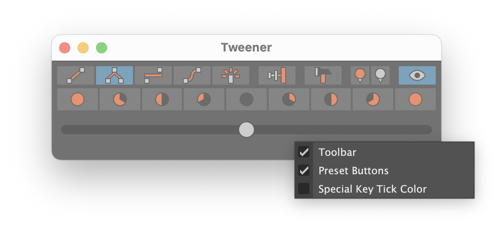

# Tweener 

Tweener has nothing to do with young people, basketball or [that tennis move between your legs](https://en.wikipedia.org/wiki/Tweener_(tennis)).

Instead, Tweener is a tool similar to TweenMachine or aTools/animBot. It allows you to quickly create in-betweens or adjust 
existing keys by interpolating towards adjacent keyframes, and can speed-up your workflow when creating breakdowns and 
in-betweens.

I am an animator myself and so I very much tailor the tool to my own needs.

## Requirements

Maya 2017 Update 3 or later.

## Installation

Download [tweener-install.py](https://github.com/monoteba/maya-tweener/raw/master/tweener-install.py) (right-click, save link as...) and drag 
the file into Maya's viewport. Make sure it is a `.py` file and not a `.txt` file.

If you prefer to manually install the plug-in, refer to the "Installation" page in the [wiki](https://github.com/monoteba/maya-tweener/wiki).

## Documentation

Please refer to the [wiki](https://github.com/monoteba/maya-tweener/wiki).

## Getting Started

After installing Tweener, click the shelf button 

Alternatively, you can execute `tweener` as a MEL command.

Tweener is quite simple. Select the tween mode and drag the slider to interpolate between poses. I'll encourage you to 
explore each type. See the description of each mode below.

### Blend Modes

| Icon | Mode | Description |
| :---: | :--- | :--- |
|  | Between | Interpolates between two adjacent keys, ignoring the current key. |
|  | Towards | Interpolates towards two adjacent keys based on the current key. |
|  | Average | Interpolates towards the average value of the selected keys. |
|  | Curve | Interpolates along the curve formed by the two adjacent keys' tangents. |
|  | Default | Interpolates towards or away from the default value of each attribute. |

### Additional Buttons

| Icon | Name | Description |
| :---: | :--- | :--- |
|  | Overshoot | Extends the interpolation from `[-100:100]` to `[-200:200]` and allows you to go past the target. |
|  | Key Hammer | Adds a key for all attributes, wherever a key is already set. This ensures that all attributes are keyed on all keyframes. Useful if you think like a traditional animator or need to retime. |
|  | Special Tick Color | Sets the current frame, selected keys, or time range to the special keyframe tick color. Caution: This cannot be undone! |
|  | Normal Tick Color | Sets the current frame, selected keys, or time range to the normal keyframe tick color. Caution: This cannot be undone! |
|  | Live Preview | Toggles live preview when dragging slider. |

### Other Options

A few additional options can be accessed by right-clicking anywhere in the window.

The toolbar and preset button can be shown or hidden for a smaller window.

Keys can automatically use the _special tick color_. This applies to both new and existing keys. Caution: Modifying key colors cannot currently be undone! Note also, that due to a limitation in Maya, the selected range in the Time Slider panel will be lost when modifying the key color.

## Known Issues

Please refer to the [issues](https://github.com/monoteba/maya-tweener/issues) page for known issues.

## Licensing

Tweener is licensed under the **GNU General Public License v3.0**. See the [license file](LICENSE) for more information.

## Support Development

If this tool brings you joy, you can share it with your friends or buy me a coffee with the button below.  

Knowing that someone finds it useful greatly motivates me :)
