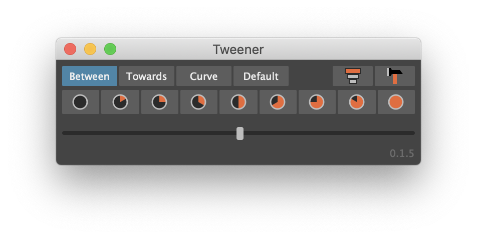

# Tweener

<p align="center">

</p>

Tweener is a tool similar to TweenMachine or aTools/animBot. It allows you to quickly create inbetweens or adjust 
existing keys by interpolating towards adjacent keyframes, and can speed-up your workflow when creating breakdowns and 
inbetweens.

I am an animator myself and so I very much tailor the tool to my own needs.

## Requirements

Maya 2017 Update 3 or later.

## Installation

Download [tweener-install.py](https://github.com/mortenblaa/maya-tweener/raw/master/tweener-install.py) and drag 
the file into Maya's viewport.

If you prefer to manually install the plug-in, refer to "Manual Installation" further down this page.

## Description

Tweener is quite simple. There's a slider and a drop-down menu to select the type of inbetween. I'll encourage you to 
explore each type. Below is a description of each type:

### Tween Modes

#### Between
Interpolates between two adjacent keys, ignoring the current key.

#### Towards
Interpolates towards two adjacent keys based on the current key.

#### Curve
Interpolates along the curve formed by the two adjacent keys' tangents.

#### Default
Interpolates towards or away from the default value of each attribute.

### Additional Buttons

| Icon | Name | Description |
| --- | --- | --- |
|  | Overshoot | Extends the interpolation from -100:100 to -200:200 and allows you to go past the target. |
|  | Key Hammer | Adds a key for every attribute for any key on selected objects.<br><br>Can be filtered by selecting attributes in the Channel Box or selecting curves in the Graph Editor.<br><br>The manual equivalent method would be to go to the first key and press `S`, go to the next keyframe and press `S`, go to the next keyframe and press `S` etc. for every keyframe. |

## Known Limitations
The tool is still at an early stage and there are few limitations to be aware of. 

- Does not work with animation layers!

## Manual Installation

Download the latest release from the [Releases](https://github.com/mortenblaa/maya-tweener/releases) page. Unzip the 
file and copy the contents to your Maya's plug-ins folder.

Typical locations:

**Windows:** `C:/Users/<username>/Documents/maya/plug-ins/`

**macOS:** `~/Library/Preferences/Autodesk/maya/plug-ins/`

In some cases the plug-ins folder will not exists, in which case you can just create it.

**Restart Maya after copying the files.** 

You can verify the installation of the plug-in by seeing if `tweener.py` shows up in the Plug-in Manager.

All plug-in paths can be found using the following Python code in the Script Editor:

```python
import maya.mel
paths = maya.mel.eval('getenv MAYA_PLUG_IN_PATH').split(':')
for p in paths:
    print p
```

After the plug-in is succesfully installed, execute the following three lines as Python or add them to a shelf button:

```python
import maya.cmds as cmds
cmds.loadPlugin(tweener.py, q=True)
cmds.tweener()
```
